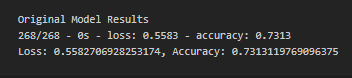

# Welcome to the Venture Capital (VC) Applicant Classifier Project!
***
## Cotents<a id="Contents">
[Project Description](#Project-Description) 
[Technologies and Resources](#Technologies-Resources) 
[Installation Guide](#Installation-Guide) 
[Usage](#Usage) 
[Contributors](#Contributors) 
[License](#License) 
[Bottom of Page](#Bottom-of-Page) 

***
## <a id="Project-Description">Project Description</a>
This project provides venture capital firms with deep learning models for predicting applicants' success. This project uses the following Data Science methods and Python tools to generate models for candidate classification:
 - Neural networks
 - Deep learning
 - TensorFlow
 - Keras
 - Scikit-learn 
    
#### Project layout:
The layout of this project is show below. 
. 
├── data 
│   ├── applicants_data.csv 
│   ├── applicants_data.h5 
│   ├── applicants_data_A1.h5 
│   ├── applicants_data_A2.h5 
│   └── applicants_data_A3.h5 
├── img 
│   └── neural-network-model-accuracy-report.png 
├── LICENSE 
├── README.md 
├── tree.txt 
└── venture_funding_with_deep_learning.ipynb 

***
## <a id="Technologies-Resources">Technologies and Resources</a>
#### Technologies:
<a href="https://docs.python.org/release/3.8.0/" title="https://docs.python.org/release/3.8.0/">

***
## <a id="Installation-Guide">Installation Guide</a>
### Project Installation
To install <a href="https://github.com/jasonjgarcia24/vc-applicant-classifier.git" title="https://github.com/jasonjgarcia24/vc-applicant-classifier.git">vc-applicant-classifier</a>, type <code>git clone https://github.com/jasonjgarcia24/vc-applicant-classifier.git</code> into bash in your prefered local directory.  
Alternatively, you can navigate to the same address (<code>https://github.com/jasonjgarcia24/vc-applicant-classifier.git</code>) and download the full <code>main</code> branch's contents as a zip file to your prefered local directory. 

## <a id="Usage">Usage</a>
Observe vc-applicant-classifier with <code>venture_funding_with_deep_learning.ipynb</code>. No input variables are required. 

### Outputs
This tool provides several visualizations for both MercadoLibre Google traffic and sales performance analysis:
Deep learning model accuracy reports are generated for each customized approach: 
 

***
## <a id="Contributors">Contributors</a>
Currently just me :) 

***
## <a id="License">License</a>
Each file included in this repository is licensed under the <a href="https://github.com/jasonjgarcia24/vc-applicant-classifier/blob/53dc9a508bf8f1a1b34fc2a086ef9d2e3a293d8b/LICENSE" title="LICENSE">MIT License.</a>

***
[Top of Page](#Top-of-Page) 
[Contents](#Contents) 
[Project Description](#Project-Description) 
[Technologies and Resources](#Technologies-Resources) 
[Installation Guide](#Installation-Guide) 
[Usage](#Usage) 
[Contributors](#Contributors) 
[License](#License) 

